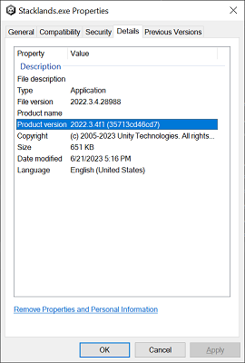
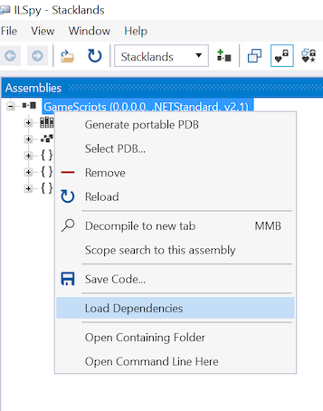
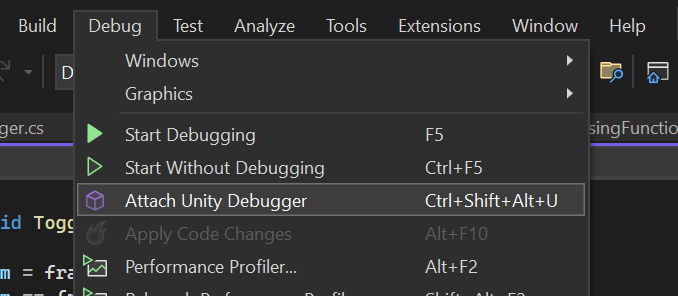
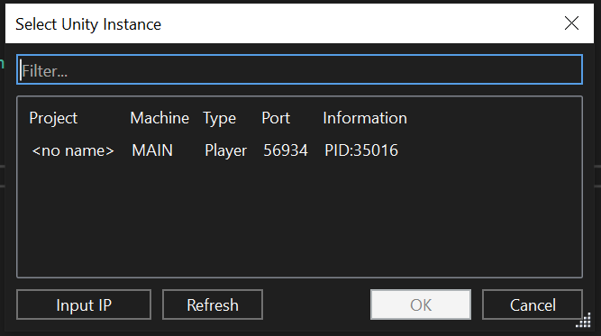
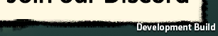

# Unity Debugging
These are my personal notes of how to get Unity Debugging to work.

The commonly suggested doc is the dnSpy version [here](https://github.com/dnSpy/dnSpy), but it talks about mono and hacked builds, which is not longer correct.

These instructions are for .NET x64 games, which is basically all Unity games these days.
# Visual Studio
Install Visual Studio with Unity Engine option.

Note - I believe that there is an issue where one of the .dll's aren't installed with VS2022.  I think this is the one that I had to install VS2019 just for that .dll.

## Find the Unity Version
* Go to the .exe for the game and go to properties.

 

* Install the Unity Editor for that version.  Note, the "Unity Hub" is the app that has to be installed.  When that app is run, there are options to install the editors.
	* https://learn.unity.com/tutorial/install-the-unity-hub-and-editor#

* Go to the editor's Playback directory: 
```
C:\Program Files\Unity\Hub\Editor\2022.3.4f1\Editor\Data\PlaybackEngines\windowsstandalonesupport\Variations\win64_player_development_mono
```
In this example, the Unit version is 2022.3.4.f1

Copy the files:
```
WindowsPlayer.exe
WinPixEventRuntime.dll
UnityPlayer.dll
```

To the Game's directory.
Rename `WindowsPlayer.exe` to the game's .exe (overwriting)


# boot.config


  Add the following to the game's *_Data/boot.config file.


```
player-connection-mode=Listen
player-connection-debug=1
player-connection-wait-timeout=-1
wait-for-managed-debugger=0
```

### Wait for debugger at start

To attach a debugger to the game before Unity actually starts, add 
`wait=for-managed-debugger=1`
to the boot.config

This is useful if the code is at the very start of the game.

# Game's Debug.dll

Decompile the game's .DLL (Usually `Assembly-CSharp.dll` in the Game's `/*Data/Managed/` folder).
ILSpy is probably the best tool for this.

If you have winget, the package is ``icsharpcode.ILSpy``

Otherwise, the offical page is [here](https://github.com/icsharpcode/ILSpy)

Open the .csproj file in Visual Studio and compile it in debug mode. Copy the .dll and the .pdb to the game's Managed directory and overwrite the .dll.

# Using ILSpy to decompile the .dll
Open ILSpy and find the game's .dll

Make sure to right click the .dll and click "Load Dependencies" before decompiling.


Then use the menu to "Save Code", which will ask for a directory.  The file will be a .csproj file and the directory will contain all the code.

# Attach Debugger

Run the game.  When the game is running, attach the debugger:



There should be an Instance window with an entry in the list:


Select the entry and hit ok.

## In Game indicator
Also, when in the game (even without attaching the debugger), there should be a "Development Build" indicator in the lower right, and the Dev console on the left.




# Testing
Put a breakpoint on some function that is called.  Like the World Manager or GameScreen, etc.  Usually the Update or LateUpdate functions are good choices since they are called every frame.

The debugger should break on that point.


# Game Updates
Every time the game is updated, this install will need to happen again as any changed files will be overwritten by the installer.
Also, the code for the .dll has to be decompiled since it may have changed.

# Restoring the Game
To restore the game back to normal, use your game providers "Verify Files" functionality.  

# Issues

## Steam Launcher

For steam games, launch from the launcher and not the game's exe.  Steam's DRM will often prevent execution.

The Shortcuts created by steam are a decent option.

## Conditional breakpoints

Visual Studio conditional breakpoints generally don't work.  Usually Unity and Visual Studio will just lock up.


## Debugger not working
### Connection Refused / not showing up.
If for some reason debugging is not working or showing up, try completely exiting Steam and starting the game again.

If that doesn't work, sometimes it requires an entire system restart.  I'm not sure why, but this fixes it.  Just signing off and on doesn't work.


